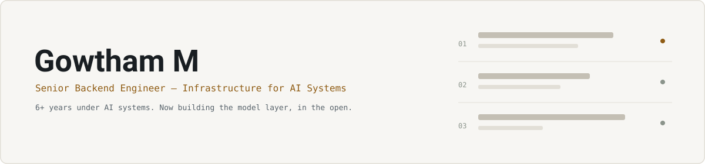

  <picture>
    <source media="(prefers-color-scheme: dark)" srcset="assets/banner-dark.svg">
    <source media="(prefers-color-scheme: light)" srcset="assets/banner-light.svg">
    
  </picture>

Backend engineer, 6+ years. I build the infrastructure under AI systems —
distributed workflow engines, async document pipelines, multi-tenant identity.
Now building the model layer too, in the open.

<a href="https://gowthamm-dev.github.io">Site</a> ·
<a href="https://gowthamm-dev.github.io/blog/">Writing</a> ·
<a href="https://www.linkedin.com/in/gowtham-m-a42a8a262/">LinkedIn</a> ·
<a href="mailto:gautham.muthuswamy@gmail.com">Email</a>

### Building now

| Project | Status | Stack |
| --- | --- | --- |
| Structured extraction service | In progress | `Python` `Pydantic` `FastAPI` |
| RAG + eval harness | Queued | `Python` `Vector DB` `pytest` |
| Agent with guardrails | Queued | `Python` `FastAPI` |

<code>Python</code> <code>Django</code> <code>FastAPI</code> <code>Kafka</code> <code>Redis</code> <code>PostgreSQL</code> <code>React</code> <code>TypeScript</code> <code>Docker</code>

